IRA Social Media Activity - Twitter, FB and Reddit
================
jlukito
September 2, 2019

Data Import
===========

In this section, I import the time series data and aggregate to the weekly level

``` r
pol_cont2 <- read.csv("polcomm_ira3platform_data.csv", header = TRUE, sep = ",") 
colnames(pol_cont2) #used to see column names
```

    ##  [1] "X"                 "date"              "sock_fb"          
    ##  [4] "sock_tw"           "sock_reddit"       "ru2us"            
    ##  [7] "us2ru"             "ru2us_disagree"    "ru2us_threat"     
    ## [10] "ru2us_conflict"    "us2ru_disagree"    "us2ru_threat"     
    ## [13] "us2ru_conflict"    "trump_favorable"   "clinton_favorable"
    ## [16] "us_pol_event"

``` r
pol_cont2$date <- as.Date(pol_cont2$date, format = "%m/%d/%Y")

xts_sock_tw <- ts(pol_cont2$sock_tw) %>% xts (order.by = pol_cont2$date) %>% apply.weekly(sum) 
xts_sock_fb <- ts(pol_cont2$sock_fb) %>% xts (order.by = pol_cont2$date) %>% apply.weekly(sum)
xts_sock_reddit <- ts(pol_cont2$sock_reddit) %>% xts (order.by = pol_cont2$date) %>% apply.weekly(sum)
xts_sock_ru2us <- ts(pol_cont2$ru2us) %>% xts (order.by = pol_cont2$date) %>% apply.weekly(sum) #all RU to US events
xts_sock_us2ru <- ts(pol_cont2$us2ru) %>% xts (order.by = pol_cont2$date) %>% apply.weekly(sum) #all US to RU events
xts_trump_approve <- ts(pol_cont2$trump_favorable) %>% xts (order.by = pol_cont2$date) %>% apply.weekly(mean)
xts_us_event <- ts(pol_cont2$us_pol_event) %>% xts (order.by = pol_cont2$date) %>% apply.weekly(sum)


xts_ru2us_disagree <- ts(pol_cont2$ru2us_disagree) %>% xts (order.by = pol_cont2$date) %>% apply.weekly(sum) #CAMEO 11 and 12
xts_ru2us_threat <- ts(pol_cont2$ru2us_threat) %>% xts (order.by = pol_cont2$date) %>% apply.weekly(sum) #CAMEO 13 and 15
xts_us2ru_threat <- ts(pol_cont2$us2ru_threat) %>% xts (order.by = pol_cont2$date) %>% apply.weekly(sum) #CAMEO 13 and 15
xts_us2ru_disagree <- ts(pol_cont2$us2ru_disagree) %>% xts (order.by = pol_cont2$date) %>% apply.weekly(sum) #CAMEO 11 and 12
```

Data Descriptives
=================

IRA Tweets and Retweets: <https://blog.twitter.com/en_us/topics/company/2018/enabling-further-research-of-information-operations-on-twitter.html> <br/> IRA Facebook Ads: <https://intelligence.house.gov/social-media-content/social-media-advertisements.htm> <br/> IRA Reddit Accounts: <https://www.reddit.com/wiki/suspiciousaccounts> <br/>

Approval of Trump: <https://www.realclearpolitics.com/epolls/other/trump_favorableunfavorable-5493.html#polls> <br/> Event count are from GDELT: <https://www.gdeltproject.org/data.html> <br/> Events were identified using the CAMEO codes: <http://data.gdeltproject.org/documentation/CAMEO.Manual.1.1b3.pdf> <br/> For events, "disagree" refers to the following categories: Demand (10), Disapprove (11), and Reject (12) <br/> For events, "threat" refers to the followig categories: Threat (13) and Military Posturing (15) <br/>

I plot the 8 time series below: the 3 time series of IRA activity, the 4 time series of Russia to US and US to Russian activity, and Trump's approval rating.

``` r
ggtsdisplay(xts_sock_reddit, plot.type = "partial", points = FALSE, smooth = TRUE, 
            main = "Count of IRA Posts and Comments on Reddit",
            xlab = "Weekly",
            ylab = "Number of Posts")  #not stationary
```

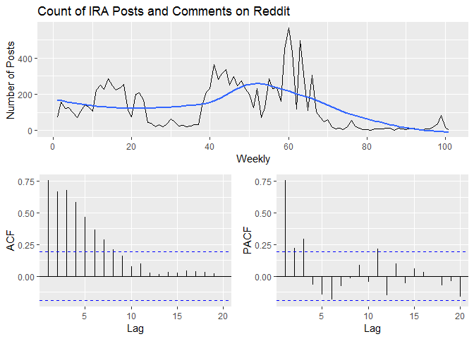

``` r
ggtsdisplay(xts_sock_fb, plot.type = "partial", points = FALSE, smooth = TRUE, 
            main = "Count of IRA Facebook Ads",
            xlab = "Weekly",
            ylab = "Number of Ads")  #not stationary
```

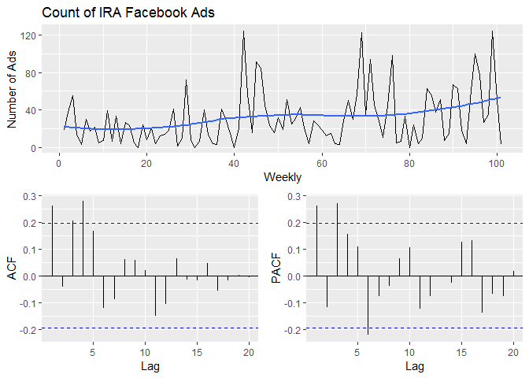

``` r
ggtsdisplay(xts_sock_tw, plot.type = "partial", points = FALSE, smooth = TRUE, 
            main = "Count of IRA tweets and retweets",
            xlab = "Weekly",
            ylab = "Number of Tweets")  #not stationary
```

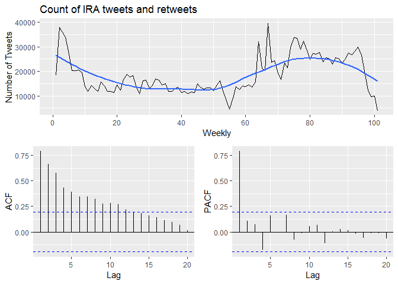

``` r
ggtsdisplay(xts_ru2us_threat, plot.type = "partial", points = FALSE, smooth = TRUE, 
            main = "Count of Russian force signaling towards US",
            xlab = "Weekly",
            ylab = "Number of Events")  #not stationary
```

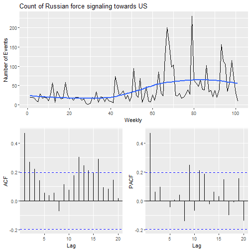

``` r
ggtsdisplay(xts_ru2us_disagree, plot.type = "partial", points = FALSE, smooth = TRUE,
            main = "Count of Russia disagreeing with the US",
            xlab = "Weekly",
            ylab = "Number of Events")  #not stationary
```

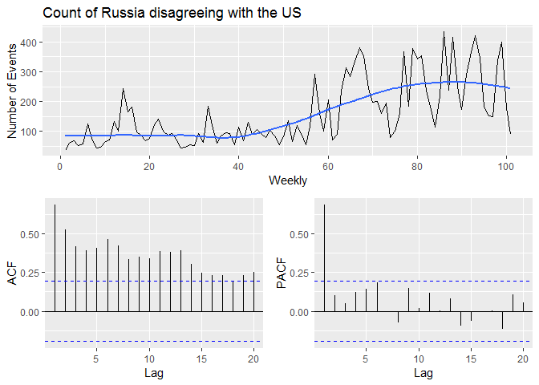

``` r
ggtsdisplay(xts_us2ru_threat, plot.type = "partial", points = FALSE, smooth = TRUE, 
            main = "Count of US force signaling towards Russia",
            xlab = "Weekly",
            ylab = "Number of Events")  #not stationary
```

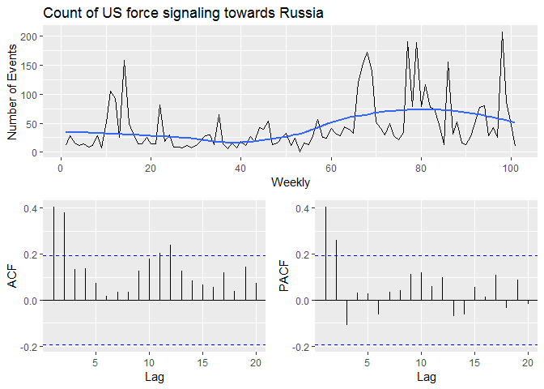

``` r
ggtsdisplay(xts_us2ru_disagree, plot.type = "partial", points = FALSE, smooth = TRUE,
            main = "Count of US disagreeing with Russia",
            xlab = "Weekly",
            ylab = "Number of Events")  #not stationary
```

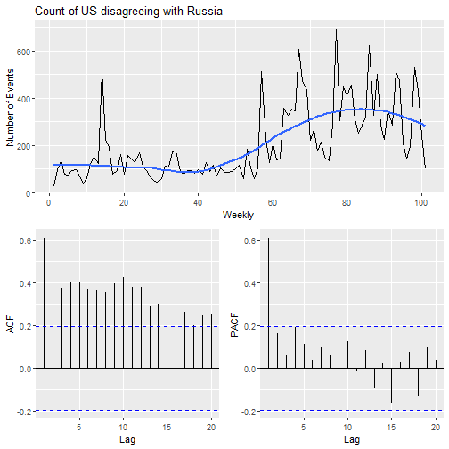

``` r
ggtsdisplay(xts_trump_approve, plot.type = "partial", points = FALSE, smooth = TRUE, #median follower of acct
            main = "Approval Rating of Trump (Candidate/President)",
            xlab = "Weekly",
            ylab = "Approval Rating")  #not stationary
```

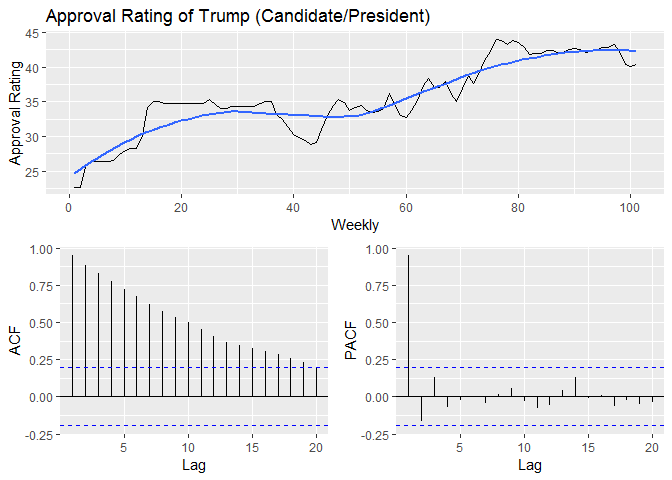

Plot of IRA activity on Facebook, Twitter, and Reddit

``` r
ts.plot(ts(xts_sock_fb), ts(xts_sock_tw), ts(xts_sock_reddit), gpars = list(col = c("blue","light blue","red")),
        main = "IRA on Facebook ads (blue), Twitter (light blue) and Reddit (red)",
        xlab = "Daily", ylab = "# of Posts") +
  abline(v=550, col="dark grey", lty = 2)
```

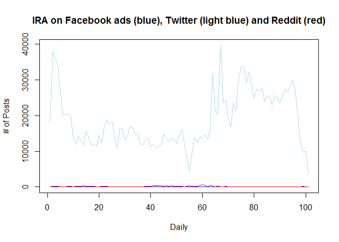

    ## integer(0)

Univariate Analysis
-------------------

``` r
#auto.arima(xts_sock_reddit, ic = "bic", trace = TRUE)
reddit_arima <- auto.arima(xts_sock_reddit, ic="bic")
#plot(reddit_arima)
#plot(forecast(reddit_arima, h = 10))

fb_arima <- auto.arima(xts_sock_fb, ic = "bic")
tw_arima <- auto.arima(xts_sock_tw, ic = "bic")#arfima(xts_sock_tw, ic="bic")

reddit_arima
```

    ## Series: xts_sock_reddit 
    ## ARIMA(0,1,1) 
    ## 
    ## Coefficients:
    ##           ma1
    ##       -0.4368
    ## s.e.   0.0838
    ## 
    ## sigma^2 estimated as 6437:  log likelihood=-579.99
    ## AIC=1163.97   AICc=1164.1   BIC=1169.18

``` r
fb_arima
```

    ## Series: xts_sock_fb 
    ## ARIMA(0,1,2) 
    ## 
    ## Coefficients:
    ##           ma1      ma2
    ##       -0.6191  -0.3188
    ## s.e.   0.1175   0.1180
    ## 
    ## sigma^2 estimated as 779.8:  log likelihood=-474.82
    ## AIC=955.64   AICc=955.89   BIC=963.45

``` r
tw_arima
```

    ## Series: xts_sock_tw 
    ## ARIMA(0,1,0) 
    ## 
    ## sigma^2 estimated as 22672505:  log likelihood=-988.73
    ## AIC=1979.45   AICc=1979.49   BIC=1982.06

Correlation Check
-----------------

``` r
reddit_resid <- reddit_arima$residuals
fb_resid <- fb_arima$residuals
tw_resid <- tw_arima$residuals

#resid <- data.frame(reddit = reddit_resid, fb = fb_resid, tw= tw_resid)

cor.test(reddit_resid, fb_resid)
```

    ## 
    ##  Pearson's product-moment correlation
    ## 
    ## data:  reddit_resid and fb_resid
    ## t = -0.22643, df = 99, p-value = 0.8213
    ## alternative hypothesis: true correlation is not equal to 0
    ## 95 percent confidence interval:
    ##  -0.2172242  0.1734598
    ## sample estimates:
    ##         cor 
    ## -0.02275076

``` r
cor.test(fb_resid, tw_resid)
```

    ## 
    ##  Pearson's product-moment correlation
    ## 
    ## data:  fb_resid and tw_resid
    ## t = -0.5348, df = 99, p-value = 0.594
    ## alternative hypothesis: true correlation is not equal to 0
    ## 95 percent confidence interval:
    ##  -0.2465253  0.1432702
    ## sample estimates:
    ##         cor 
    ## -0.05367195

``` r
cor.test(reddit_resid, tw_resid)
```

    ## 
    ##  Pearson's product-moment correlation
    ## 
    ## data:  reddit_resid and tw_resid
    ## t = 0.44735, df = 99, p-value = 0.6556
    ## alternative hypothesis: true correlation is not equal to 0
    ## 95 percent confidence interval:
    ##  -0.1518577  0.2382623
    ## sample estimates:
    ##        cor 
    ## 0.04491455

VAR Analysis
============

In this section, I prepare the data for a VAR analysis by first-differencing non-stationary series, and by organizing the variables into the appropriate order.

Fractional Integration & Diff
-----------------------------

To do a VAR analysis, it is necessary to remove the integrated component of the above time series. Most of the time series are fully-integrated, one is fractionaly-so. These will be differenced out.

``` r
ndiffs(xts_sock_fb)
```

    ## [1] 1

``` r
ndiffs(xts_sock_tw)
```

    ## [1] 1

``` r
ndiffs(xts_sock_reddit) 
```

    ## [1] 1

``` r
ndiffs(xts_trump_approve) 
```

    ## [1] 1

``` r
ndiffs(xts_us_event) #stationary
```

    ## [1] 0

``` r
ndiffs(xts_ru2us_disagree)
```

    ## [1] 1

``` r
ndiffs(xts_ru2us_threat) 
```

    ## [1] 1

``` r
ndiffs(xts_us2ru_disagree) 
```

    ## [1] 1

``` r
ndiffs(xts_us2ru_threat) 
```

    ## [1] 1

``` r
fd_sock_fb <- diff(xts_sock_fb, d = 1)
fd_sock_tw <- diff(xts_sock_tw, differences = 1)
fd_sock_reddit <- diff(xts_sock_reddit, differences = 1)

fd_ru2us_disagree <- diff(xts_ru2us_disagree, differences = 1)
fd_ru2us_threat <- diff(xts_ru2us_threat, differences = 1)

fd_us2ru_threat <- diff(xts_us2ru_threat, differences = 1)
fd_us2ru_disagree <- diff(xts_us2ru_disagree, differences = 1)

fd_trump_approval <- diff(xts_trump_approve, differences = 1)

ts.plot(ts(fd_sock_fb), ts(fd_sock_reddit), ts(fd_sock_tw), gpars = list(col = c("blue","red","light blue")),
        main = "IRA on Facebook ads (blue), Twitter (light blue) and Reddit (red)",
        xlab = "Daily", ylab = "# of Posts")
```

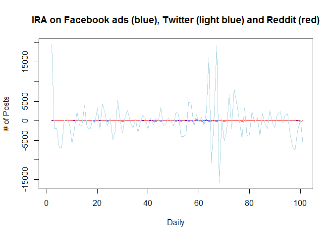 All series had unit roots and were first-differenced.

Cointegration Test
------------------

This checked for co-integration betwen my sockpuppet activity time series. For my edification, I also checked the sockpuppet activity on Twitter and Trump approval. There appears to be no co-integrated relationships.

``` r
library(egcm)
```

    ## Warning: package 'egcm' was built under R version 3.6.1

``` r
cointegration_fbtw <- data.frame(xts_sock_fb, xts_sock_tw) %>% ts()
cointegrate_fbtw <- egcm(cointegration_fbtw)
```

    ## Warning in pp.test(X): p-value smaller than printed p-value

``` r
#plot(cointegrate_fbtw)

cointegration_fbrd <- data.frame(xts_sock_fb, xts_sock_reddit) %>% ts()
cointegrate_fbrd <- egcm(cointegration_fbrd)
```

    ## Warning in pp.test(X): p-value smaller than printed p-value

``` r
#plot(cointegrate_fbtw)

cointegration_rdtw <- data.frame(xts_sock_reddit, xts_sock_tw) %>% ts()
cointegrate_rdtw <- egcm(cointegration_fbtw)
```

    ## Warning in pp.test(X): p-value smaller than printed p-value

``` r
#plot(cointegrate_fbtw)

is.cointegrated(cointegrate_fbtw)
```

    ## [1] FALSE

``` r
is.cointegrated(cointegrate_fbrd)
```

    ## [1] FALSE

``` r
is.cointegrated(cointegrate_rdtw)
```

    ## [1] FALSE

``` r
ts.plot(ts(xts_sock_tw), ts(xts_trump_approve), gpars = list(col = c("blue","black")),
        main = "IRA on Twitter (Blue) and Trump Approval (Black)",
        xlab = "Daily", ylab = "-")
```

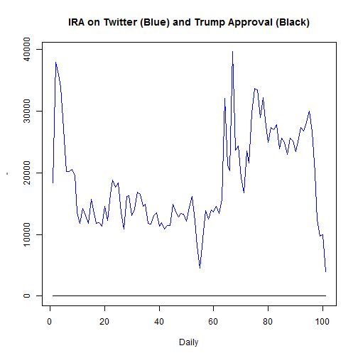

``` r
cointegration_tw_trump <- data.frame(xts_sock_tw, xts_trump_approve) %>% ts()
cointegrate_tw_trump <- egcm(cointegration_tw_trump)
is.cointegrated(cointegrate_tw_trump)
```

    ## [1] FALSE

Vector AutoRegression
=====================

``` r
#First Differenced
sockpuppet_var <- data.frame(sock_fb = fd_sock_fb, sock_tw = fd_sock_tw, sock_reddit = fd_sock_reddit,
                             ru2us_disagree = fd_ru2us_disagree,
                             ru2us_threat = fd_ru2us_threat,
                             #us_event = xts_us_event
                             us2ru_disagree = fd_us2ru_disagree,
                             us2ru_threat = fd_us2ru_threat,
                             trump_approval = fd_trump_approval
                             ) #follower count
#colnames(sockpuppet_var)
var_endo <- subset(sockpuppet_var, select = c(sock_fb, sock_reddit, sock_tw))

var_exo <- subset(sockpuppet_var, select = c(ru2us_disagree, ru2us_threat, us2ru_disagree, us2ru_threat, trump_approval))
```

Now, we want to select the appropriate number of lags.

``` r
library(tsDyn)

tot <- lags.select(var_endo, lag.max = 8) #I like this one because I rely on the BIC most often
tot
```

    ## Best AIC:  lag= 4 
    ## Best BIC:  lag= 2 
    ## Best HQ :  lag= 2

``` r
tot$BICs
```

    ##        lag=1   lag=2    lag=3    lag=4    lag=5    lag=6    lag=7 lag=8
    ## r=0 3065.461 3057.89 3084.049 3097.651 3120.508 3150.013 3178.139    NA

``` r
tot$AICs
```

    ##       lag=1    lag=2    lag=3    lag=4    lag=5    lag=6    lag=7 lag=8
    ## r=0 3035.07 3004.706 3008.071 2998.879 2998.943 3005.654 3010.988    NA

BIC (Baysian Info Criterion) recommends a lag of 2.

Toda Yamamoto Method for Two-Way Granger Causality, holding all else constant.

``` r
toda.yamamoto <- function(var) {
  # add the magic lag to the existing VAR model
  ty.df <- eval(var$call$y);
  ty.varnames <- colnames(ty.df);
  ty.lags <- var$p + 2;
  ty.augmented_var <- VAR(ty.df, ty.lags, type=var$type);

  ty.results <- data.frame(predictor = character(0), causes = character(0), chisq = numeric(0), p = numeric(0));

  for (current_variable in ty.varnames) {
    # construct the restriction matrix: to test if *current_variable* causes any of the others,
    # we test if the lagged values of current variable (ignoring the magic lag) are jointly insignificant

    ty.restrictions <- as.matrix(Bcoef(ty.augmented_var))*0+1;
    ty.coefres <- head(grep(current_variable, colnames(ty.restrictions), value=T), -1);
    ty.restrictions[which(rownames(ty.restrictions) != current_variable), ty.coefres] <- 0;
    # estimate restricted var
    ty.restricted_var <- restrict(ty.augmented_var, 'manual', resmat=ty.restrictions);

    for (k in 1:length(ty.varnames)) {
      if (ty.varnames[k] != current_variable) {
        my.wald <- waldtest(ty.augmented_var$varresult[[k]], ty.restricted_var$varresult[[k]], test='Chisq');
        ty.results <- rbind(ty.results, data.frame(
                        predictor = current_variable, 
                        causes = ty.varnames[k], 
                        chisq = as.numeric(my.wald$Chisq[2]), 
                        p = my.wald$`Pr(>Chisq)`[2])
        );
      }
    }
  }
  return(ty.results);
}
```

VAR - Events as Exogenous
=========================

``` r
var_endo2 <- var_endo[2:101,]
var_exo2 <- var_exo[2:101,] %>% as.data.frame()

varresult_x <- VAR(var_endo2, p = 2, exogen = var_exo2) #run VAR analysis 
summary(varresult_x)
```

    ## 
    ## VAR Estimation Results:
    ## ========================= 
    ## Endogenous variables: sock_fb, sock_reddit, sock_tw 
    ## Deterministic variables: const 
    ## Sample size: 98 
    ## Log Likelihood: -1968.289 
    ## Roots of the characteristic polynomial:
    ## 0.7311 0.7311 0.6142 0.6142 0.2229 0.2229
    ## Call:
    ## VAR(y = var_endo2, p = 2, exogen = var_exo2)
    ## 
    ## 
    ## Estimation results for equation sock_fb: 
    ## ======================================== 
    ## sock_fb = sock_fb.l1 + sock_reddit.l1 + sock_tw.l1 + sock_fb.l2 + sock_reddit.l2 + sock_tw.l2 + const + ru2us_disagree + ru2us_threat + us2ru_disagree + us2ru_threat + trump_approval 
    ## 
    ##                  Estimate Std. Error t value Pr(>|t|)    
    ## sock_fb.l1     -0.4826736  0.0919312  -5.250 1.08e-06 ***
    ## sock_reddit.l1 -0.0055969  0.0381000  -0.147    0.884    
    ## sock_tw.l1      0.0006734  0.0007907   0.852    0.397    
    ## sock_fb.l2     -0.5503172  0.0955880  -5.757 1.29e-07 ***
    ## sock_reddit.l2 -0.0400456  0.0411116  -0.974    0.333    
    ## sock_tw.l2      0.0009871  0.0006826   1.446    0.152    
    ## const           0.8678249  3.0733222   0.282    0.778    
    ## ru2us_disagree  0.0327624  0.0688947   0.476    0.636    
    ## ru2us_threat   -0.0480074  0.0907629  -0.529    0.598    
    ## us2ru_disagree -0.0086980  0.0496041  -0.175    0.861    
    ## us2ru_threat   -0.0889240  0.0983039  -0.905    0.368    
    ## trump_approval -3.2188039  3.3447912  -0.962    0.339    
    ## ---
    ## Signif. codes:  0 '***' 0.001 '**' 0.01 '*' 0.05 '.' 0.1 ' ' 1
    ## 
    ## 
    ## Residual standard error: 29.85 on 86 degrees of freedom
    ## Multiple R-Squared: 0.3767,  Adjusted R-squared: 0.2969 
    ## F-statistic: 4.724 on 11 and 86 DF,  p-value: 1.241e-05 
    ## 
    ## 
    ## Estimation results for equation sock_reddit: 
    ## ============================================ 
    ## sock_reddit = sock_fb.l1 + sock_reddit.l1 + sock_tw.l1 + sock_fb.l2 + sock_reddit.l2 + sock_tw.l2 + const + ru2us_disagree + ru2us_threat + us2ru_disagree + us2ru_threat + trump_approval 
    ## 
    ##                  Estimate Std. Error t value Pr(>|t|)    
    ## sock_fb.l1      0.1407810  0.2496483   0.564   0.5743    
    ## sock_reddit.l1 -0.4304472  0.1034644  -4.160  7.5e-05 ***
    ## sock_tw.l1     -0.0031825  0.0021471  -1.482   0.1419    
    ## sock_fb.l2      0.1312142  0.2595786   0.505   0.6145    
    ## sock_reddit.l2 -0.2682828  0.1116426  -2.403   0.0184 *  
    ## sock_tw.l2     -0.0006777  0.0018536  -0.366   0.7156    
    ## const          -2.2701487  8.3459090  -0.272   0.7863    
    ## ru2us_disagree  0.0894641  0.1870902   0.478   0.6337    
    ## ru2us_threat   -0.0189762  0.2464755  -0.077   0.9388    
    ## us2ru_disagree -0.0453246  0.1347047  -0.336   0.7373    
    ## us2ru_threat    0.1871439  0.2669540   0.701   0.4852    
    ## trump_approval -4.6106010  9.0831099  -0.508   0.6130    
    ## ---
    ## Signif. codes:  0 '***' 0.001 '**' 0.01 '*' 0.05 '.' 0.1 ' ' 1
    ## 
    ## 
    ## Residual standard error: 81.06 on 86 degrees of freedom
    ## Multiple R-Squared: 0.2442,  Adjusted R-squared: 0.1476 
    ## F-statistic: 2.526 on 11 and 86 DF,  p-value: 0.008245 
    ## 
    ## 
    ## Estimation results for equation sock_tw: 
    ## ======================================== 
    ## sock_tw = sock_fb.l1 + sock_reddit.l1 + sock_tw.l1 + sock_fb.l2 + sock_reddit.l2 + sock_tw.l2 + const + ru2us_disagree + ru2us_threat + us2ru_disagree + us2ru_threat + trump_approval 
    ## 
    ##                  Estimate Std. Error t value Pr(>|t|)    
    ## sock_fb.l1        5.66401   11.61729   0.488   0.6271    
    ## sock_reddit.l1   17.73981    4.81468   3.685   0.0004 ***
    ## sock_tw.l1       -0.08494    0.09992  -0.850   0.3976    
    ## sock_fb.l2      -10.29798   12.07940  -0.853   0.3963    
    ## sock_reddit.l2  -10.97630    5.19525  -2.113   0.0375 *  
    ## sock_tw.l2       -0.06330    0.08626  -0.734   0.4650    
    ## const          -475.55029  388.37386  -1.224   0.2241    
    ## ru2us_disagree   -7.64052    8.70618  -0.878   0.3826    
    ## ru2us_threat     15.64252   11.46965   1.364   0.1762    
    ## us2ru_disagree    3.24877    6.26844   0.518   0.6056    
    ## us2ru_threat    -13.45344   12.42261  -1.083   0.2818    
    ## trump_approval 1070.21908  422.67924   2.532   0.0132 *  
    ## ---
    ## Signif. codes:  0 '***' 0.001 '**' 0.01 '*' 0.05 '.' 0.1 ' ' 1
    ## 
    ## 
    ## Residual standard error: 3772 on 86 degrees of freedom
    ## Multiple R-Squared: 0.3457,  Adjusted R-squared: 0.262 
    ## F-statistic: 4.131 on 11 and 86 DF,  p-value: 6.952e-05 
    ## 
    ## 
    ## 
    ## Covariance matrix of residuals:
    ##              sock_fb sock_reddit  sock_tw
    ## sock_fb       891.00       23.56    -4463
    ## sock_reddit    23.56     6570.66   -20420
    ## sock_tw     -4462.71   -20420.16 14228589
    ## 
    ## Correlation matrix of residuals:
    ##               sock_fb sock_reddit  sock_tw
    ## sock_fb      1.000000    0.009737 -0.03964
    ## sock_reddit  0.009737    1.000000 -0.06678
    ## sock_tw     -0.039635   -0.066784  1.00000

Two-way Granger Causality
-------------------------

``` r
toda.yamamoto(varresult_x)
```

    ##     predictor      causes      chisq            p
    ## 1     sock_fb sock_reddit  0.4990937 0.9190904752
    ## 2     sock_fb     sock_tw  3.3632822 0.3389316179
    ## 3 sock_reddit     sock_fb  0.6897835 0.8756043040
    ## 4 sock_reddit     sock_tw 18.3831064 0.0003666502
    ## 5     sock_tw     sock_fb  2.7149911 0.4376857149
    ## 6     sock_tw sock_reddit  1.8363889 0.6070485033

Impact Response Functions
-------------------------

``` r
plot(irf(varresult_x, impulse = "sock_reddit", response = "sock_tw", n.ahead = 5, ortho = FALSE, cumulative = TRUE)) +
  title(sub = "Shock = Reddit // Response = Twitter")
```

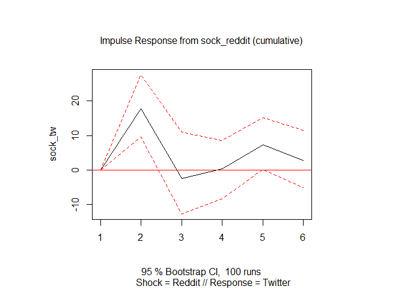

    ## integer(0)

``` r
plot(irf(varresult_x, impulse = "sock_tw", response = "sock_reddit", n.ahead = 5, ortho = FALSE, cumulative = TRUE)) +
  title(sub = "Shock = Twitter // Response = Reddit")
```

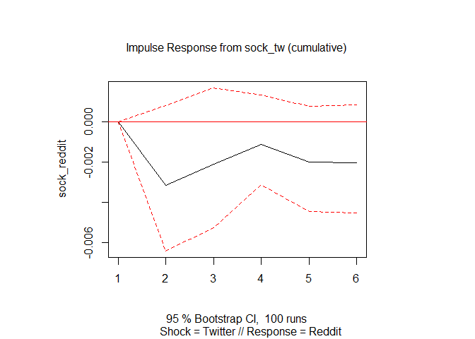

    ## integer(0)

Model Checking
==============

Endogeneity Test of Residuals
-----------------------------

Durbin-Watson Test

``` r
dwtest(varresult_x$varresult$sock_fb, exact = FALSE)
```

    ## 
    ##  Durbin-Watson test
    ## 
    ## data:  varresult_x$varresult$sock_fb
    ## DW = 2.1906, p-value = 0.7641
    ## alternative hypothesis: true autocorrelation is greater than 0

``` r
dwtest(varresult_x$varresult$sock_tw, exact = FALSE)
```

    ## 
    ##  Durbin-Watson test
    ## 
    ## data:  varresult_x$varresult$sock_tw
    ## DW = 2.0437, p-value = 0.7641
    ## alternative hypothesis: true autocorrelation is greater than 0

``` r
dwtest(varresult_x$varresult$sock_reddit, exact = FALSE)
```

    ## 
    ##  Durbin-Watson test
    ## 
    ## data:  varresult_x$varresult$sock_reddit
    ## DW = 2.0461, p-value = 0.7641
    ## alternative hypothesis: true autocorrelation is greater than 0

Residuals Check
---------------

Ljung-Box Test

``` r
residualz <- residuals(varresult_x)
colnames(residualz)
```

    ## [1] "sock_fb"     "sock_reddit" "sock_tw"

``` r
Box.test(residualz[,1], type='Ljung',lag=1) # retweets
```

    ## 
    ##  Box-Ljung test
    ## 
    ## data:  residualz[, 1]
    ## X-squared = 1.2294, df = 1, p-value = 0.2675

``` r
Box.test(residualz[,2], type='Ljung',lag=1) # network followers
```

    ## 
    ##  Box-Ljung test
    ## 
    ## data:  residualz[, 2]
    ## X-squared = 0.05726, df = 1, p-value = 0.8109

``` r
Box.test(residualz[,3], type='Ljung',lag=1) #interaction with verified actors
```

    ## 
    ##  Box-Ljung test
    ## 
    ## data:  residualz[, 3]
    ## X-squared = 0.068385, df = 1, p-value = 0.7937

These results confirm that the data are radomly distributed. <br/> A plot of the residuals appears to look like white noise.

``` r
ggtsdisplay(residualz[,1])
```

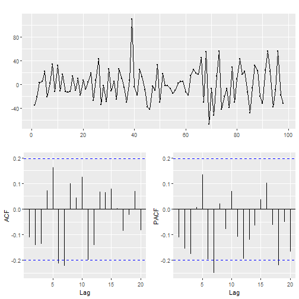

``` r
ggtsdisplay(residualz[,2])
```

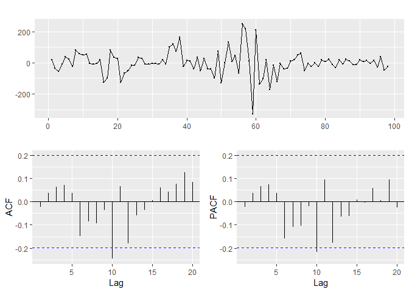

``` r
ggtsdisplay(residualz[,3])
```

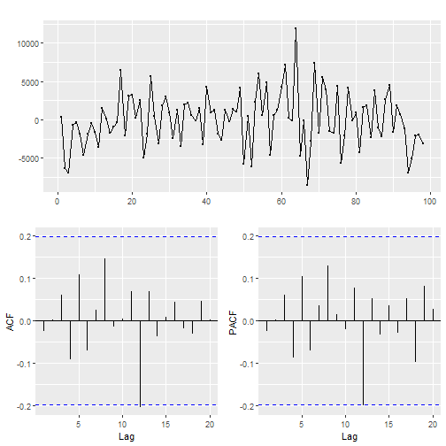

Licensed under [CC BY](https://creativecommons.org/licenses/by/2.0/)
